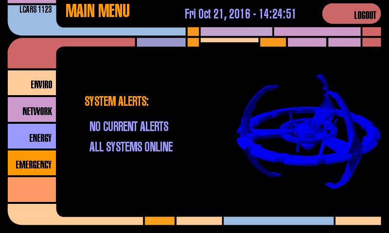

# Raspberry Pi LCARS Interface
This project is an attempt to create a functional [LCARS](https://en.wikipedia.org/wiki/LCARS) interface for the [Raspberry Pi](https://raspberrypi.org/) using [Pygame](http://www.pygame.org). It's based heavily on the pioneering work of [Toby Kurien](https://tobykurien.com/).

# Changes/Additions
- Functional navigation buttons on side panel
- Functional (but not secure!) authentication screen

# Branches
The master branch of this repository is the code running on my personal hardware setup. It may or may not be useful for others as-is. The secondary "core" branch is intended to be suitable for upstream merges or for other users who wish to customize their own version.

Changes made in "core" will, whenever possible, retain backwards compatibility with the original code.

# Acknowledgements
- Orignal code by Toby Kurien
- Inspiration and advice from [Techni Myoko](https://sites.google.com/site/neotechni/)
- LCARS is copyright [CBS Studios Inc.](http://www.cbs.com/) and is subject to [the fair use statute](http://www.lcars.mobi/legal/)
- LCARS images and audio assets from [lcarscom.net](http://www.lcarscom.net)

# License
> **Note**: Original code from Toby Kurien was released under the MIT license. I am invoking my right to sublicense that project and have released this fork under the GPLv3. For merging purposes, the "core" branch retains its original MIT license.

This program is free software; you can redistribute it and/or modify it under the terms of the GNU General Public License version 3 as published by the Free Software Foundation.

This program is distributed in the hope that it will be useful, but WITHOUT ANY WARRANTY; without even the implied warranty of MERCHANTABILITY or FITNESS FOR A PARTICULAR PURPOSE.

For details, see the file "COPYING" in the source directory.
